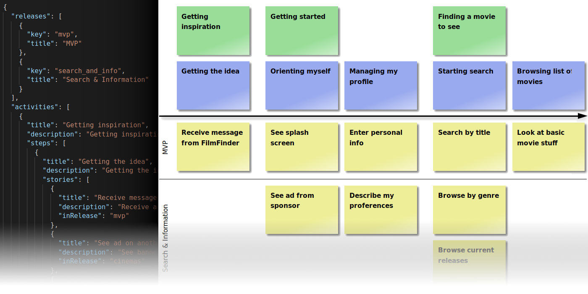

# usm.io

A lightweight solution to integrate backlog management into your development workflow and to put your backlog into the repository with your code.



## What is it?

_usm.io_ can render an User Story Map from a structured data representation into an interactive website.

The USM is defined in _json_ format, that is complemented by _Markdown_ or _HTML_ to describe the contents of the cards in the map.

This makes working on your backlog as simple as possible, as you can use your well-known development tool and focus on the stories, while _usm.io_ takes care of proper visualization.

## Why use it?

_usm.io_ is a different approach to backlog management as opposed to common backlog management tools, which have several disadvantages:

1. They store data separately from the actual code. So keeping the backlog in sync with the code is often tedious and taking a snapshot over your whole toolchain is difficult or even impossible.

2. They usually are very heavy on features. This comes in handy if you want to represent elaborate workflows, but it's a bit over the top if you just want to manage your backlog.

3. The only way to interact with them is a graphical user interface. But keeping your backlog tidy can be annoying if it involves a lot of clicking around and waiting for things to be loaded.

_usm.io_ offers a lightweight approach to editing your backlog as code and keep it in the repository with your code.

Plus: it visualizes the backlog as an [User Story Map](https://www.jpattonassociates.com/user-story-mapping/) wich gives you great transparency over your roadmap.

## How to use it

_usm.io_ comes as a npm package that you can install in your own NodeJS project:

```sh
$ npm install --save usm.io
```

You can now use it like this:

```js
const Usm = require('usm.io')

const context = {
  inputDir: './input', // where to look for sources
  outputDir: './web', // where to put rendered pages
  cardsWebroot: 'localhost:80/usm' // your hosting domain and directory. If used locally: a absolute or relative directory path.
}
const mapOptions = { ... }
const cardsOptions = { ... }

const usm = new Usm(context)
await Promise.all([
  usm.renderMap(mapOptions),
  usm.renderCards(cardsOptions)
])
```

> Please see the source code in the `example`(./example) directory for details `mapOptions` and `cardsOptions`.

For each rendering feature there's an asynchronous function that takes the input from the `inputDirectory` and writes the rendered output to the `outputDirectory`. They can be run concurrently.

If you're working in a team, a good practice is to integrate the generator into your build pipeline, have it run with each push to the main branch and publish the build results as a website. This way you can assure that the visualization of your backlog stays up to date with your repository and is accessible to everyone.

### Run the Example

This repository comes with an [example](./example) that shows how you can integrate the generator into your project. It also includes stylesheets and scripts that bring the generated html map to life. They are a good starter for your own project.

See [example](./example/).

## How to provide the input

See [The User Story Map](./docs/the-user-story-map.md) for details on how user story mapping works, the features of _usm.io_ and how you need to structure your map to make it render correctly.

## Contribute

I'm happy for any help with _usm.io_. If you would like to contribute, please [look into the issues](https://github.com/frederikheld/usm.io/issues) to [see which new features are already in the backlog](https://github.com/frederikheld/usm.io/milestone/1) and [which chores need to be done](https://github.com/frederikheld/usm.io/labels/chores).

If you have a good idea for a new feature or improvement, feel free to [file a new issue](https://github.com/frederikheld/usm.io/issues/new) or submit a pull request.
