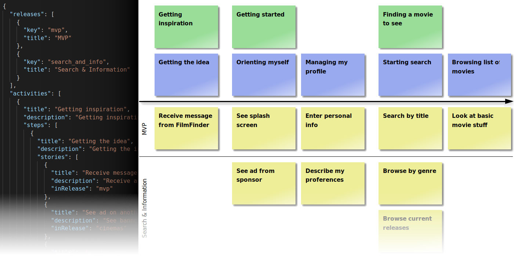

# usm.io

A lightweight solution to integrate backlog management into your development workflow and to put your backlog into the repository with your code.



## What is it?

_usm.io_ can render an User Story Map from a structured data representation into an interactive website.

The USM is defined in _json_ format, that is complemented by _Markdown_ or _HTML_ to describe the contents of the cards in the map.

This makes working on your backlog as simple as possible, as you can use your well-known development tool and focus on the stories, while _usm.io_ takes care of proper visualization.

## Why use it?

_usm.io_ is a different approach to backlog management as opposed to common backlog management tools, which have several disadvantages:

1. They store data separately from the actual code. So keeping the backlog in sync with the code is often tedious and taking a snapshot over your whole toolchain is difficult or even impossible.

2. They usually are very heavy on features. This comes in handy if you want to represent elaborate workflows, but it's a bit over the top if you just want to manage your backlog.

3. The only way to interact with them is a graphical user interface. But keeping your backlog tidy can be annoying if it involves a lot of clicking around and waiting for things to be loaded.

_usm.io_ offers a lightweight approach to editing your backlog as code and keep it in the repository with your code.

Plus: it visualizes the backlog as an [User Story Map](https://www.jpattonassociates.com/user-story-mapping/) wich gives you great transparency over your roadmap.

## How to use it

The easiest way to get started is to use the [example](example) that comes with the package.

### Installation

    $ npm install --save usm.io

### Render the User Story Map

Make some changes in [example/input/usm.json](example/input/usm.json) or one of the packages, then re-generate the webpages by running

    $ cd example
    $ node generator.js

This will generate the webpages in [example/web](example/web). Open [example/output/index.html](example/output/index.html) in your favorite webbrowser to see the result.

### The User Story Map

If you don't know the method of User Story Mapping yet, I recommend you to read [Jeff Pattons publications](https://www.jpattonassociates.com/user-story-mapping/).

To get started with _usm.io_ you only need to now the following: User Story Maps consist of Acitivties (the green cards in the example) that are broken down into Steps (blue). Each Step consists of User Stories (yellow) that are grouped into Releases (separated by horizontal lines).

Each card can be just a title on the card, but you can also create a full package that renders out as a little website.

This brings us to the two main features of _usm.io_:

1. it can render the User Story Map into a webpage (as shown in the image above)
2. it can render Cards into websites, which are linked from within the map.

The json file that represents the User Story Map, has to be structured as follows:

```json
{
  "releases": [
    {
      "key": "mvp",
      "title": "MVP"
    },
    <...>
  ],
  "activities": [
    {
      "title": "Getting inspiration",
      "description": "Getting inspiration",
      "steps": [
        {
          "title": "Getting the idea",
          "description": "Getting the idea to watch a movie",
          "stories": [
            {
              "title": "Receive message from FilmFinder",
              "description": "Receive a message from FilmFinder about a movie on my watch list available to see",
              "inRelease": "mvp"
            },
            <...>
          ]
        },
        <...>
      ]
    },
    <...>
  ]
}
```

First you define the releases. Their order in the list defines their order in the map.

Below that you define Activities, Steps and Stories. Each with an title and/or description, which will be rendered as the card. Activities and Steps also have a list of their siblings, while Stories can be assigned to a specific release. Cards without a defined release will be put into the yet-to-be-defined future which is the bottom of the map.

### Cards

Simple cards can be described in `usm.json`. For more elaborate cards you can put them into a package that is linked in `usm.json`.

#### Simple Card Descriptions

A card can described directly in `usm.json`. This is the quickest way to begin with a map.

```json
{
  "title": "foo",
  "description": "bar",
  "stories": [
    {
      "title": "My first Story",
      "description": "This is my first Story. o/ <( Yay! )"
    },
    <...>
  ]
}
```

If you do it this way, a Card can only have meta information like _title_ and _desciption_ but no further content.

#### Card Packages

If you want to create elaborate cards that are backed by some content, you can create card packages. Those are located in `input-dir/cards`. For each card you need to create a sub-folder that holds at least the following two files:

- `card.json`
- `index.[md|html]`

This card can be linked from `usm.json` via the `package` field.

```json
{
  "title": "foo",
  "description": "bar",
  "stories": [
    {
      "package": "my-first-story"
    },
    <...>
  ]
}
```

The Card description now has to be done in `card.json` in the respective package.

This is how `card.json` in the package `my-first-story` will look like:

```json
{
  "title": "My first Story",
  "description": "This is my first Story. o/ <( Yay! )"
}
```

The advantage of this approach: You can now place content in this package that will be rendered into a small website that is linked from within the card. This helps you with keeping notes or add conceptual work to the card.

The entrypoint for this webiste is the `index` file which, depending on the markup language you are going to use, needs to have the appropriate file name extension.

### The directory tree

The simplest User Story Map is just an `usm.json` in `input-directory` and a `output-directory`. If you want to use the packages feature, you have to give your directory tree the following structure:

```
[d] root
 ├─ [d] input-directory
 |   ├─ [f] usm.json
 |   └─ [d] cards
 |       ├─ [d] card-id-1
 |       |   ├─ [f] card.json
 |       |   ├─ [f] index.md
 |       |   └─ [d|f] <...>
 |       └─ [d] <...>
 └─ [d] output-directory

```

| reference                     | type      | description                                                                                                                                                                                                                                                                                                                                      | multiplicity | naming |
| ----------------------------- | --------- | ------------------------------------------------------------------------------------------------------------------------------------------------------------------------------------------------------------------------------------------------------------------------------------------------------------------------------------------------ | ------------ | ------ |
| root                          | dir       | The root of your project                                                                                                                                                                                                                                                                                                                         |              |        |
| <nobr>input-directory</nobr>  | dir       | Will be referenced as `inputDir` in the context object                                                                                                                                                                                                                                                                                           | 1            | free   |
| <nobr>usm.json</nobr>         | file      | This file describes the User Story Map                                                                                                                                                                                                                                                                                                           | 1            | fixed  |
| cards                         | dir       | this is where usm.renderAllCards() will look for packages to render                                                                                                                                                                                                                                                                              | 0..1         | fixed  |
| <nobr>card-id-1</nobr>        | dir       | This name can be used in usm.json to reference the card. You can define as many cards as you want.                                                                                                                                                                                                                                               | 0..\*        | free   |
| <nobr>card.json</nobr>        | file      | This file holds the card's meta data. It follows the same rules as usm.json. Fields in usm.json will overwrite fields in card.json.                                                                                                                                                                                                              | 1            | fixed  |
| <nobr>index.[md\|html]</nobr> | file      | This file is the root of the contents of the card. The name is fixed but you can choose between the available file type extensions.                                                                                                                                                                                                              | 1            | fixed  |
| <..>                          | file\|dir | Besides the mandatory index file, you can have as many files as you need to describe the card. Graphics and other assets that can be linked are allowed as well.                                                                                                                                                                                 | 0..\*        | fixed  |
| output-directory              | dir       | Will be referenced as `outputDir` in the context object. `usm.renderMap()` will render `usm.json` into `index.html` in the `output-directory`. `usm.RenderCards()` will write the Card packages to the same file system tree as in `inputDir`. The naming will be the same except for the file name extension of those files that were rendered. | 1            | free   |

### Supported markup languages

Supported markup languages are right now:

| Language | Extension | Processor                                                 |
| -------- | --------- | --------------------------------------------------------- |
| Markdown | .md       | [markdown-it](https://github.com/markdown-it/markdown-it) |
| HTML     | .html     | \<not being processed\>                                   |

Starting from `index`, you can add additional pages and ressources as you like. Everything that is not supported as a markdown language will just copied & pasted into the target directory. The directory tree in the target directroy will be the same as in your package. Links to other markup files will be converted automatically into links to the generated html file. This way you are free to add content as you like.

## Integrate _usm.io_ into your app

The [example](example) that comes with this package the usage of _usm.io_. It also includes stylesheets and scripts that bring the generated html map to life. They are a good starter for your own project.

The entry point for your User Story Map is the Usm object. It expects a context object as parameter:

```javascript
const Usm = require("usm.io");
const path = require("path");

const context = {
  inputDir: path.join(__dirname, "input"),
  outputDir: path.join(__dirname, "output"),
  cardsWebroot: "cards"
};
const usm = new Usm(context);
```

The context object can take the following parameters:

| parameter      | type                | description                                                                                    | mandatory |
| -------------- | ------------------- | ---------------------------------------------------------------------------------------------- | --------- |
| `inputDir`     | path in file system | Where to look for sources                                                                      | yes       |
| `outputDir`    | path in file system | where to put rendered results                                                                  | yes       |
| `cardsWebroot` | weblink             | This can be an absolute or relative link to the cards, which is used for the link in usm cards | yes       |

> Note: There's no sanity check if the data given in the context object is correct. So make sure your paths and links are valid!

For each rendering feature there's an asynchronous function that takes the input from the `inputDirectory` and writes the rendered output to the `outputDirectory`:

```javascript
await usm.renderMap();
await usm.renderCards();
```

## Learn more

To understand how the User Story Map and the cards packages can be done, look into the example. It shows all possible approaches.

For more detailled information on the features of _usm.io_ read the tests. [usm/tests/usm.test.js](usm/tests/usm.test.js) is good for a start.

## Next Steps in Development

### Features

- [ ] Provide more useful error messages.

  Example: If "stories" is missing, error says "UnhandledPromiseRejectionWarning: TypeError: Cannot read property 'length' of undefined".

  Solution: This message should be more specific and help to find the error. E. g. "Field 'stories' missing in ...". It should also help to fix/avoid the error, e. g. "Field 'stories' is mandatory for a step."

  Also make renderer more flexible. This specific example shouldn't lead to an error at all. It should be allowed to leave fields undefined.

- [x] Implement releases in map

### Styling & Usability

- [ ] Stylesheet for rendered packages
- [ ] Package title in title of web page (at least for md which doesn't allow to define meta data)
- [ ] Common footer & header for packages and map. Package header should have a link back to the USM.
- [ ] Make Releases sticky on left side of the viewport
- [ ] Make Activities and Steps sticky on top of the viewport

### Under the hood

- [ ] Improve test coverage (a lot of cases aren't testet yet)
- [ ] Clean up test suites (make structure more suitable as a documentation)
- [ ] Remove duplication: There's a lot of duplication in all the modules. There should be one generic module for containers and one for card representations. All the specific modules should extend one of those two basic modules.
- [x] Remove unused mocks
